# iSeeHealth - A Health Management System

**Final Project for CS5004 Object Oriented Design and Analysis Summer 2023**

## Introduction
This is the final project for CS 5004 Object-Oriented Design and Analysis Summer 2023 by Yiwen Wang.
The **objectives** for this final project are:

1. Demonstrate my mastery of OOD to solve a challenging problem 
2. Design a solution with MVC architecture with JavaFX 
3. Apply all (or most) of the programming concepts used in this course 
4. Use design patterns to raise cohesion and lower coupling as well as to avoid re-inventing the
  wheel 
5. Meet objectives of the CS5004 course

Because the original course repo is in the class organization and set as private, the following is the information from that repo:

## Project Design

This project started from the problem that I have to log in my data in different Applications on phone, however, not in a simple way.
Therefore, I would like to solve this problem by designing a Health Management System that can help me to log in my data in a simple way and generate reports for me to check my health status.

### Design ideas
This health system is **designed** to have the following sections:

1. Morning check includes weight, blood pressure, skin condition, Pain check, and Digestive system check. This is just a log for me to check in the future, and I will develop it to add more features like health analysis with these daily login data. This is the basic check for overweight people like me to remind myself how I have recently been.

2.  Fitness check includes the time for three exercises: aerobic, strength, and mobility. And with these daily login data, there will be weekly and monthly reports for goal days. Exercise time is very important because I'm not too fond of aerobic exercises and only do strength and mobility. Still, I need aerobic exercises to lose fat, so I must log in to check for enough aerobic time. The goals are set in a class called constants for easy management of these constants and easy for people to understand.

3.  Diet check includes the daily percentage of fat, protein, and carbohydrate; check for take-ins of vegetables and fruits; and check for sugar take-ins by checking if sugar, sweet beverages, ice cream, and snacks. Weekly and monthly reports will also be generated by calculating goal days.

4.  Mental Check includes some very basic checks like if depressed, if anxious, if sad, if joy, etc. This part is because mental status is very important to the weight loss process, so it is important to be aware of one’s mental status.

There will be a dashboard to welcome the user. Also, there will be exceptions handling to prevent the user to input invalid data.

### MVC explanation
**The MVC(Model-View-Controller) will be:**

* Model: Models will represent the data and the rules that govern access to and updates of this data. These will be the backend codes of all the checks and report generator. 
* View: Views define what is presented to the user. The interface will consist of multiple views, which will be the FXML files.
* Controller: Controllers handle the user interaction, typically taking user input from the views and then implementing this interaction by manipulating the models, which are the controller classes. 

### Data Storage
For the final project, I am using a simple way to store the data: updating the .CSV when there is a new daily entry for a check, and the new ones for the same day will overwrite the old ones. 

But in the future, I will improve the data management by using mySQL to store the data and use JDBC to connect the database with the program.

### Design Patterns

|            Pattern Name             | Class(es)        | Justification                                                                                                                                                                                                                                                                                                                                                                |
|:-----------------------------------:|------------------|:-----------------------------------------------------------------------------------------------------------------------------------------------------------------------------------------------------------------------------------------------------------------------------------------------------------------------------------------------------------------------------|
|     MVC (Model-View-Controller)     | `Controllers`    | This is implicit from the use of controllers in your JavaFX code. JavaFX inherently follows the MVC pattern, where the FXML files act as the View, the controller classes (like WeeklyReportsController and Controllers) act as the Controller, and the data or logic classes (not shown directly but could be inferred from classes like ReportGenerator) act as the Model. |
|              Singleton              | `Constants`      | lthough it wasn't explicitly shown in the code snippets, the use of constants like Constants.DASHBOARD2_FXML suggests that there might be a single source of truth for configuration or settings, which could be managed by the Singleton pattern.                                                                                                                           |
|               Factory               | `Controllers`    | The use of the FXMLLoader to load different scenes in JavaFX can be considered an example of the Factory Method pattern, where objects (in this case, scenes or views) are created without specifying the exact class of object that will be created.                                                                                                                        |
|              Observer               | `Controllers`    | This pattern is used here to let a User's state changes be observed by the controller classes. Whenever the User's state changes, the corresponding Controller gets notified and acts accordingly. It improves the modularity of the program by separating the responsibilities of tracking changes and responding to changes into different components.                     |
|           Strategy          | `Checks` | This pattern is used here to allow the User class to use any type of Check. It allows the User class to add any Check (MorningCheck, FitnessCheck, DietCheck, MentalCheck) dynamically, which means we can add or remove a Check without modifying the User class. It makes the User class loosely coupled with the Check classes.                                           |

## UML Class Diagram

The **UML** for Health Management System:

```mermaid
---
title: Health Management
---
classDiagram
    class Main{
        +strat(Stage stage): void
        +main(String[] args): void$
    }

    class Check {
        <<Interface>>
        +updateOrAppendToCSV(): void
        +toCSV(): String
    }

    class Constants{
        + String DIET_CHECK_CSV $
        + String MORNING_PAIN_CHECK_CSV $
        + String MORNING_DIGEST_CHECK_CSV$
        +  String MORNING_BASIC_SKIN_CHECK_CSV$
        +  String MENTAL_CHECK_CSV$
        +  String FITNESS_CHECK_CSV$
        +  String DASHBOARD_FXML$
        +  String DASHBOARD2_FXML$
        +  String DASHBOARD3_FXML$
        +  String MORNING_PAIN_CHECK_FXML$
        +  String MORNING_DIGEST_CHECK_FXML$
        +  String MORNING_BASIC_SKIN_CHECK_FXML$
        +  String DIET_CHECK_FXML$
        +  String MENTAL_CHECK_FXML$
        +  String FITNESS_CHECK_FXML$
        +  String WEEKLY_REPORT_FXML$
        +  String MONTHLY_REPORT_FXML$
        +  int PROTEIN_GOAL$
        +  int FAT_GOAL$
        +  int CARBOHYDRATE_GOAL$
        +  int AEROBIC_GOAL$
        +  int STRENGTH_GOAL$
        +  int MOBILITY_GOAL$
        +  int WEEKLY_DAYS_COUNT$
        +  int MONTHLY_DAYS_COUNT$
    }

    class MorningDigestCheck {
        -  boolean isDiarrhea
        -  boolean isStomachache
        -  boolean isIntestinalPain
        -  boolean isSourRegurgitation
        -  boolean isFetidBreath
        -  boolean isVomit
        -  String otherSymptoms
        + Button iSeeHealthButton
        + Button submitButton
        + Button resetButton
        +MorningDigestCheck(boolean isDiarrhea, boolean isStomachache, boolean isIntestinalPain, boolean isSourRegurgitation, boolean isFetidBreath, boolean isVomit, String otherSymptoms)
        +updateOrAppendToCSV(): void
        +toCSV(): String
    }

    class ReportGenerator {
        +formatReport(Map<String, Integer> result, String type): String$
        +generate7DayDietReport(String csvData): Map<String, Integer>$
        +generate30DayDietReport(String csvData): Map<String, Integer>$
        +generateDietReport(String filepath, int days): Map<String, Integer>$
        +generateFitnessReport(int days): Map<String, Integer>$
    }

    class MorningPainCheck {
        -  boolean isNeck
        -  boolean isHeadache
        -  boolean isTeeth
        -  boolean isShoulder
        -  boolean isJoint
        -  String otherPain
        +MorningPainCheck(boolean isNeck, boolean isHeadache, boolean isTeeth, boolean isShoulder, boolean isJoint, String otherPain)
        +updateOrAppendToCSV(): void
        +toCSV(): String
    }

    class MorningBasicSkinCheck{
        -  int weight
        -  String bloodPressure
        -  boolean isRedness
        -  boolean isSwelling
        -  boolean isAcne
        -  boolean isScar
        -  boolean isItching
        -  String isOtherSkin
        + Button iSeeHealthButton
        +MorningBasicSkinCheck(int weight, String bloodPressure, boolean isRedness, boolean isSwelling, boolean isAcne, bollean isScar, boolean isItching, String isOtherSkin)
        +updateOrAppendToCSV(): void
        +toCSV(): String
    }


    class FitnessCheck{
        -  int aerobicMinutes
        -  int strengthMinutes
        -  int mobilityMinutes
        + FitnessCheck(int aerobicMinutes. int strengthMinutes, int mobilityMinutes)
        +updateOrAppendToCSV(): void
        +toCSV(): String
    }
    class DietCheck{
        -  int proteinPercentage
        -  int fatPercentage
        -  int carbohydratePercentage
        -  boolean isVegetable
        -  boolean isFruit
        -  boolean isSugar
        -  boolean isSugarBeverage
        -  boolean isIceCream
        -  boolean isSnack
        -  String snackName
        +DietCheck(int proteinPercentage, int fatPercentage, int carbohydratePercentage)
        +updateOrAppendToCSV(): void
        +toCSV(): String

    }
    class MentalCheck{
        -  boolean isDepressed
        -  boolean isAnxious
        -  boolean isSad
        -  boolean isAngry
        -  boolean isFear
        -  boolean isJoy
        -  boolean isHopeful
        -  boolean isSatisfaction
        -  String journal
        +MentalCheck(boolean isDepressed, boolian isAnxious, boolean isSad, boolean isAngry, boolean isFear, boolean isJoy, boolean is isHopeful, boolean isSatisfaction, String journal)
        +updateOrAppendToCSV(): void
        +toCSV(): String
    }
    Check <|.. MorningDigestCheck
    Check <|.. MorningBasicSkinCheck 
    Check <|.. FitnessCheck
    Check <|.. DietCheck
    Check <|.. MentalCheck

    class Controllers {
        + Button iSeeHealthButton
        + Button morningCheckButton
        + Button fitnessCheckButton
        + Button dietCheckButton
        + Button mentalCheckButton
        + Button exitButton
        + Button weeklyReportButton
        + Button monthlyReportButton
        # Stage stage
        # Scene scene
        +validateInput(): boolean
        +clearinput(): void
        +showErrorMessage(): void
        +isNumeric(): boolean
        +switchToDashboard2(ActionEvent event): void
        +switchToMorningCheck(ActionEvent event2): void
        +switchToFitnessCheck(ActionEvent event3): void
        +switchToDietCheck(ActionEvent event4): void
        +switchToMentalCheck(ActionEvent event5): void
        +switchToWeeklyReport(ActionEvent event6): void
        +switchToMonthlyReport(ActionEvent event7): void
        +switchToMorningPainCheck(ActionEvent event8): void
        +switchToMorningDigestCheck(ActionEvent event8): void
        +closeWindow(ActionEvent e): void
    }


    class MorningPainCheckController{
        + Button previousButton
        + Button submitButton
        + Button resetButton
        - CheckBox neckCheckBox
        - CheckBox headacheCheckBox
        - CheckBox teethCheckBox
        - CheckBox shoulderCheckBox
        - CheckBox jointsCheckBox
        - TextField otherPainTextField
        + handleSubmitButtonAction(): void
        + handleResetButtonAction(): void
        +validateInput(): boolean
        +clearinput(): void

    }

    class FitnessCheckController{
        + Button resetButton
        + Button SubmitButton
        - TextField aerobicMinsTextField
        - TextField strengthMinsTextField
        - TextField mobilityMinsTextField
        + handleSubmitButtonAction(): void
        + handleResetButtonAction(): void
        +validateInput(): boolean
        +clearinput(): void
    }

    class DietCheckController{
        + Button iSeeHealthButton
        + Button morningCheckButton
        + Button fitnessCheckButton
        + Button submitButton
        + Button resetButton
        - TextField proteinTextField
        - TextField fatTextField
        - TextField carbsTextField
        - CheckBox vegetableCheckbox
        - CheckBox fruitCheckbox
        - CheckBox sugarCheckBox
        - CheckBox sugarBeverageCheckBox
        - CheckBox iceCreamCheckBox
        - CheckBox snackCheckBox
        - TextField snackNameTextField
        + handleSubmitButtonAction(): void
        + handleResetButtonAction(): void
        +validateInput(): boolean
        +clearinput(): void
    }

    class MentalCheckController{
        + Button MorningCheckButton
        + Button resetButton
        + Button submitButton
        - CheckBox depressionCheckBox
        - CheckBox anxietyCheckBox
        - CheckBox sadnessCheckBox
        - CheckBox angryCheckBox
        - CheckBox fearCheckBox
        - CheckBox joyCheckBox
        - CheckBox hopefulCheckBox
        - CheckBox satisfactionCheckBox
        - TextField journalTextField
        + handleSubmitButtonAction(): void
        + handleResetButtonAction(): void
        +validateInput(): boolean
        +clearinput(): void
    }

    class MonthlyReportsController {
        + Button seeMonthlyReportButton
        - TextArea monthlyReportTextArea
        - Button monthlyReportButton
        - initialie(): void
        -generateMonthlyCombinedReport(): void
    }

    class MorningBasicSkinCheckController {
        + Button nextButton
        + Button resetButton
        + Button submitButton
        - TextField weightTextField
        - TextField bloodPressureTextField
        - CheckBox rednessCheckBox
        - CheckBox swellingCheckBox
        - CheckBox acneCheckBox
        - CheckBox scarCheckBox
        - CheckBox itchingCheckBox
        - TextField otherSkinTextField
        + handleSubmitButtonAction(): void
        + handleResetButtonAction(): void
        +validateInput(): boolean
        +clearinput(): void
    }
    class MorningDigestCheckController {
        + Button resetButton//button to reset the input
        + Button nextButton//button to go to the next page
        + Button previousButton//button to go back to the previous page
        + Button submitButton//button to submit the input
        - CheckBox diarrheaCheckBox
 
        - CheckBox stomachacheCheckBox
 
        - CheckBox intestinalPainCheckBox
 
        - CheckBox sourRegurgitationCheckBox
 
        - CheckBox fetidBreathCheckBox
 
        - CheckBox vomitCheckBox
 
        - TextField otherDigestTextField
        + handleSubmitButtonAction(): void
        + handleResetButtonAction(): void
        +validateInput(): boolean
        +clearinput(): void
    }

     class WeeklyReportsController {
        + Button seeWeeklyReportButton
        + AnchorPane weeklyReportPane
        - TextArea weeklyReportTextArea
        - Button weeklyReportButton
        - initialie(): void
        -generateWeeklyCombinedReport(): void
    }

    Controllers <|-- MorningDigestCheckController
    Controllers <|-- MorningPainCheckController
    Controllers <|-- MorningBasicSkinCheckController
    Controllers <|-- MonthlyReportsController
    Controllers <|-- FitnessCheckController
    Controllers <|-- DietCheckController
    Controllers <|-- MentalCheckController
```

## Project Preview

The following is the screenshots of the program:(To run the program, run main.java, and this is a gradle project created in intellij IDEA in Java)

## Documentation and Testing

My project follows the Google style format and reach 70% code coverage from my testing
on components not related to the View/Control.

Thank you for reading my project!